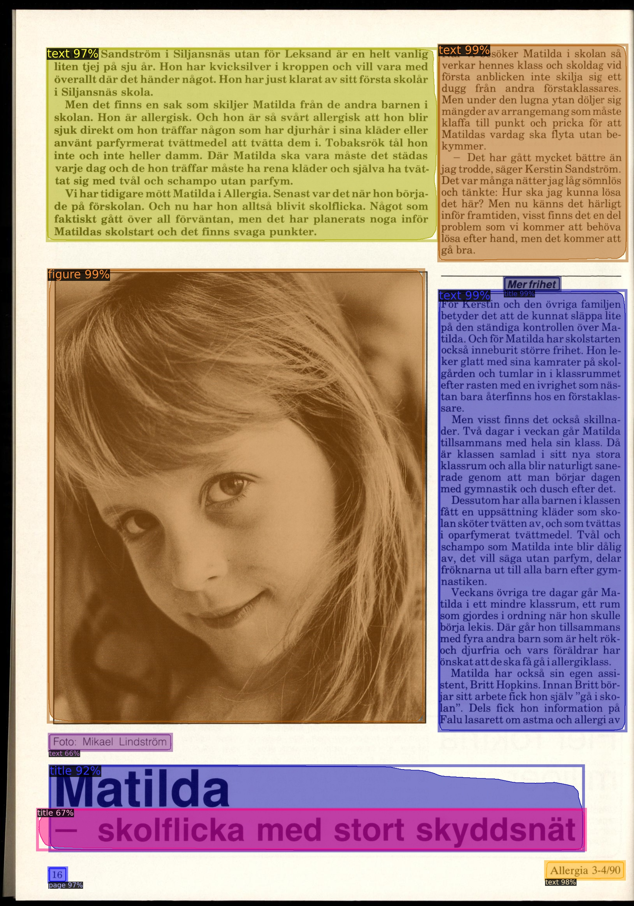
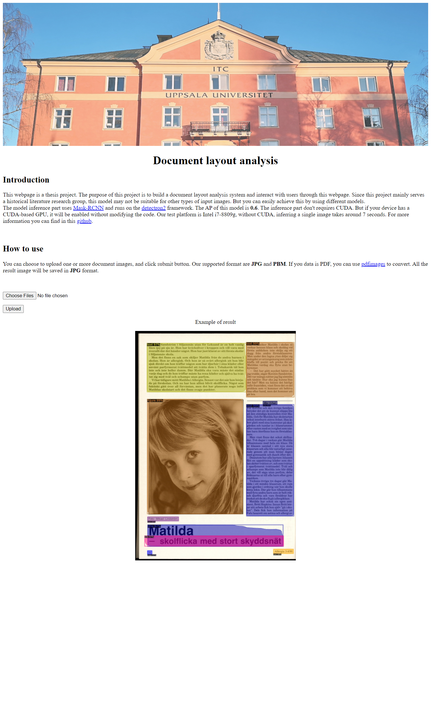
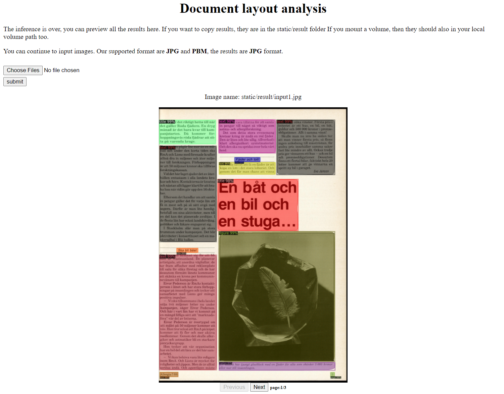
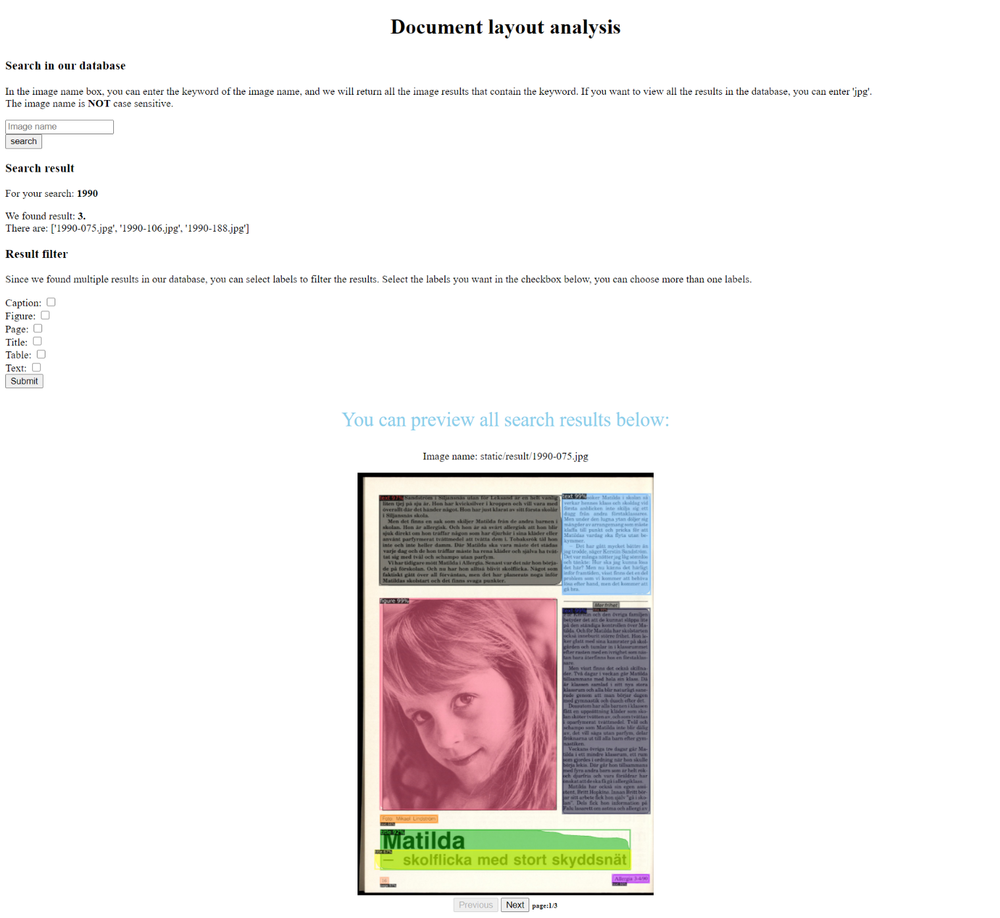
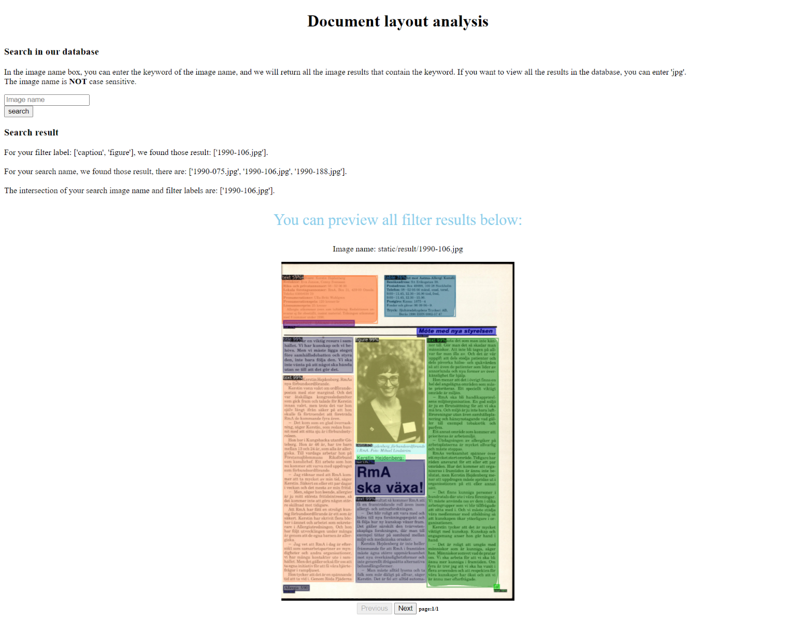

# Historical document layout analysis

## Background
The purpose of this project is to build a document layout analysis model and interact with users through a webpage. Since this project mainly serves a historical literature research group, this model may not be suitable for other types of input images. But you can easily deal with other tasks by using different models. In addition, we also [deployed this project to AWS and managed it through jenkins](https://github.com/Jambo-sudo/Jenkins-use-AWS).  

## Architecture
This project is mainly composed of two dockers. One docker including the model inference, a flask framework to build the website and accept input data. This docker can mounts a volume to achieve result data persistence. The model inference part uses [Mask-RCNN](https://arxiv.org/abs/1703.06870) and runs on the [detectron2](https://github.com/facebookresearch/detectron2) framework. 

The following figure shows a example of result image. The model marked out multiple layout divisions based on the original input. Our model can recognize 6 different document layouts: title, text, figure, caption, table and page. 

  

Another docker is [MongoDB](https://www.mongodb.com/), which is a NoSQL database that can be used to store json-like documents. The MongoDB docker use to store our json files corresponding to the result image. The json file contains all information about the inference. For our example image above, the json file looks like this:
* Labels:"{"text": 5, "figure": 1, "title": 3, "page": 1}"
* Image name:"example.jpg"
* Image path:"/home/appuser/detectron2_repo/code/static/result"  

The labels part including all the labels detected in our input image and the number of each label. Since we use MongoDB to store these data, if necessary, the inference results can do regular search. In this project, we have implemented basic search and filtering functions by labels. Users can enter the image title (or part of the title) to search for matching results. Or enter "jpg" to view all the results, because all our result are in jpg format. After getting the results, the user can also select one or more of the 6 labels to filter the results. For example, if the user selects "text" + "caption", then we will only display the results that contain both types of labels. 

### Backend
Since our inference part is written in Python, naturally we hope to build the backend through Python. In this project, we use the flask framework. Flask is good enough for this project, and it can be scaled up easily if necessary. Flask is used to achieve the following two tasks:
1. Accept user upload data and return corresponding HTML webpage.
2. Connect to MongoDB through the PyMongo library and insert the json file to MongoDB.
You can find more details in the code/maincode.py file.

### Inference webpage
The frontend contains some html files, you can find all of then in template folder. Initially, flask will return start.html, and when the backend finished, it will return result.html. 

The start page look like this:
 
When the infer done, you can see the result in webpage, like below:
 
When the input is multiple, you can switch the result through the next and previous buttons, and the page shows the total number of results. 

### Search and filter webpage
You can input a batch of images to build your own database. When you have a database, use "search" to get matching results. For example, search "1990". It will reture all the images which including 1990 in the image's name.

   
We use regular expressions in MongoDB to search results. In serach result part, we provide basic information of your search. And you can preview all results in the below.   

When you get multiple search results, you can use "filter" to further filter the results. There are 6 checkboxes in the filter section, and each checkbox represents a label. You can check the corresponding checkbox to determine the labels you want to keep. 
For example:  
  

In this case, we select "caption" and "figure". Thus, the result we get is contains both the search keyword ("1990" in this case) in image's name and the labels caption and figure.  

## Model Training
Detectron2 provides a pre-trained model's weight we can simply use it though [model zoo](https://github.com/facebookresearch/detectron2/blob/master/MODEL_ZOO.md). Obviously, we cannot use this weight in our project directly. In order to make this weight suitable for our project, we need to prepare a training set and train this weight again. This process is also called transfer learning. In this project, we use [labelme](https://github.com/wkentaro/labelme) to label our data. We manually annotated 550 data and 6919 labels, 500 data for training and 50 data for test. Detectron2 provides a [colab tutorial](https://colab.research.google.com/drive/16jcaJoc6bCFAQ96jDe2HwtXj7BMD_-m5) where you can easily train your own model with a free GPU. 
After 2000 iterations of training, the AP value of our model reach to **0.57**. 

Usually the weight provided by model zoo are more general, which means it probably not suitable for our project. Therefore, if we can find a model's target close to our project, the AP value will increase under the same training parameters. Fortunately, we found a similar [project](https://github.com/hpanwar08/detectron2). This project trained a powerful Mask-RCNN model for document layout analysis, and their AP value is close to 0.9. Of course, they paid a great price. They used the largest document layout dataset---[PubLayNet](https://github.com/ibm-aur-nlp/PubLayNet) for training, this training set contains more than 100,000 images. For ordinary document layout analysis, this weight is powerful enough. But we hope to get a weight that is more suitable for our project, rather than a powerful weight. Therefore, we use our 500 training dataset to perform transfer learning again. 
Under the same training parameters, our AP value reached **0.6**. 

This AP value is acceptable, but there is no doubt that our AP value needs to be improved. Since this is an individual project, in order to speed up the progress, we will use this model weight in our project. The most direct and effective way to increase the AP value is to increase the number of training sets. We can label the data manually, just as we did before. But since we already got a weight, we can use this model weight to generate the training set. That is, we regared the inference result of this model as a ground truth. The inference of the model will undoubtedly have errors, because our model is not perfect (obviously, if our model is perfect, there is no need to continue training). But in this way, we can easily generate thousands of data for training. In addition to the AP value, we can also add noise to the training set to improve the robustness of our model. These will be part of the future work.

## Pipeline
You can choose to upload one or more document images, the input format should be **JPG**, or **PBM**. If you data is PDF, you can use [pdfimages](https://github.com/facebookresearch/detectron2) to convert. 

When the backend receives the input, the first step is to initialize our database to avoid errors due to missing result images. We will check whether the result images in the volume matches the json file in MongoDB. If the user has deleted some images in the volume (not recommended) or image lost, the corresponding json file in MongoDB will also be deleted. 

The next step is to check whether the input image already exists in our volume, if so, add this image path to a result list, and skip the inference part. This is to avoid repeated inferences and save resource.  
If we do not have the same image in our volume, then we enter the inference stage. At this stage, the input image is inferred by our model. After the inference, we will add this image to the result list.
The inference result is an annotated image and a json file containing the inference result. The image will be saved in the volume, and the json file will be saved in MongoDB. 
When all the input has been processed (found in the database, or completed inference), we will get a result list, which contains the path of all the result images. This list will be sent to the front end, HTML will read this list, and show the result. Since we use cv2 to read and save images. In order to avoid save errors, all resulting images will be converted to jpg format.

## How to use
To run this project, you need to install docker and docker compose. The test platform is docker desktop based on WSL2. CUDA is not necessary. If your device has CUDA, it will be used by default. If you don't want to use CUDA, then you can modify it in code/deteinfer.py. Our image requires about 8GB of storage space, and you also need some space to store the inference results. Therefore, we recommend at least 10GB of storage and 4G of memory.

### Use docker-compose
Copy docker-compose under **this path** (that is, the directory you are currently in. We have another docker-compose in historical-document-analysis, NOT that one) to the local. Run `docker-compose up`. 

All dependencies will be automatically installed, and two dockers will run after the installation is complete, one is the database and the other is model inference. When you see 2 dockers start, open the browser and enter localhost:5000. If all goes well, you should see the start page. 
In this way, our docker-compose will pull the image directly from the docker hub, without the dockerfile. Therefore, you **cannot** modify anything until the docker-compose build complete. So if you want to use your own model and weight, then I recommend you to use shell script.

### Use shell script
Copy build.sh to your local path, than, cd to this path and run `. ./build.sh`.
This shell script will copy all the contents of this repository to the local, and then download the pre-trained model we provide. Finally, start the container through docker-compose in the historical-document-analysis folder.

This shell script is very simple, so you can also complete all the steps manually. But with this simple script, one-step build can be achieved, which is very useful in CI/CD.

### Use your own model
If you use our build.sh, you can use the weights trained by yourself, just change the wget link in the second line of the shell script to your own model. But if the model you used is not in the config folder provided by detectron2 (see configs folder in our model docker), you need to provide a corresponding YAML file as well, just like the DLA_mask_rcnn_X_101_32x8d_FPN_3x.yaml in historical-document-analysis folder. 

In short, using your own model requires the following steps:
1. Modify the penultimate command in the dockerfile, change DLA_mask_rcnn_X_101_32x8d_FPN_3x.yaml to your own yaml.
2. Copy your model weight to code folder. You can do this by changing the link of wget function in the second line of build.sh. Or you can do it manually without build.sh.
3. Go to code/maincode.py modify line 18,19. Use your model and weights instead of ours.

## Environment
The inference part don't requires CUDA. But if your device has a CUDA-based GPU, it will be enabled without modifying the code. Our test platform is Intel i7-8809g, without CUDA, inferring a single image takes around 7 seconds. 

If you want to train your own model, most models does not support training on the CPU.
